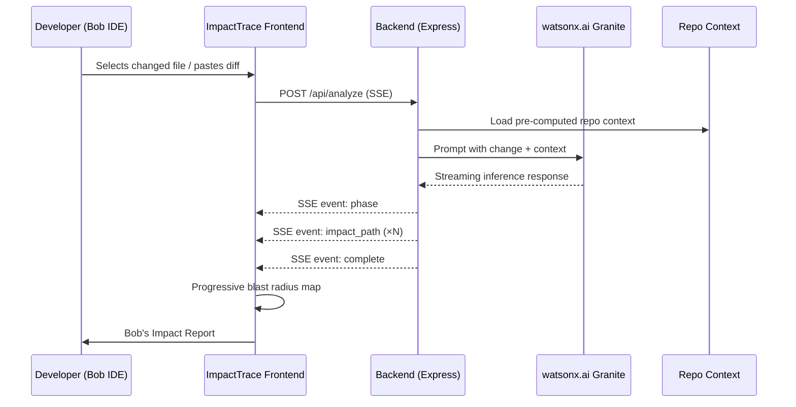
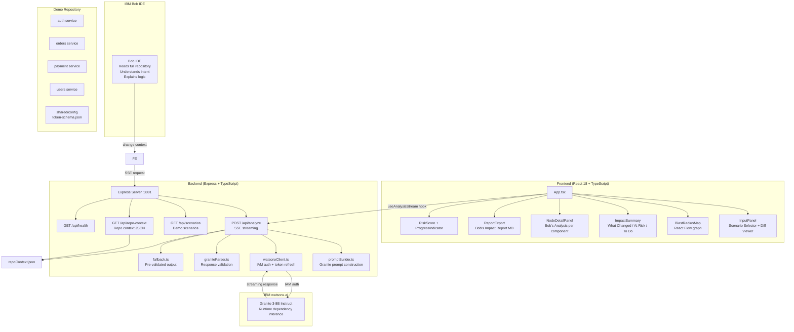

# ImpactTrace — Know What Breaks Before You Ship

Pre-commit change intelligence platform that maps the full blast radius of any proposed code change before it ships. Built for the **IBM TechXchange / lablab.ai** hackathon.

**Powered by IBM Bob IDE and IBM watsonx.ai Granite.**

---

## Architecture

```
┌──────────────────────┐
│    IBM Bob IDE        │  Developer writes code here.
│  (repo context,       │  Bob reads the full repository,
│   intent, logic)      │  understands intent behind changes.
└──────────┬───────────┘
           │ change context
           ▼
┌──────────────────────┐     ┌───────────────────────┐
│  ImpactTrace          │────▶│  ImpactTrace Backend   │
│  Frontend (React)     │     │  (Express/TypeScript)  │
│                       │◀────│                        │
└──────────────────────┘     └───────────┬───────────┘
       React Flow                        │ SSE stream
       Framer Motion                     ▼
       Tailwind CSS           ┌───────────────────────┐
                              │  watsonx.ai Granite    │
                              │  (runtime inference)   │
                              └───────────┬───────────┘
                                          ▲
                              ┌───────────────────────┐
                              │  Pre-computed Repo     │
                              │  Context (static)      │
                              └───────────────────────┘
```

### Data Flow



### Component Architecture



### Endpoints

| Method | Path | Description |
|--------|------|-------------|
| POST | `/api/analyze` | Receives change context, streams Granite response via SSE |
| GET | `/api/repo-context` | Serves pre-computed repository context JSON |
| GET | `/api/scenarios` | Lists available demo scenarios |
| GET | `/api/health` | Health check |

### SSE Event Format

```
event: phase
data: {"phase":"identifying_direct_dependencies","label":"Identifying direct dependencies"}

event: impact_path
data: {"component":"authMiddleware.js","dependencyType":"direct_caller","riskLevel":"low","explanation":"...","remediation":"..."}

event: complete
data: {"overallRisk":"high","affectedCount":14,"summary":{...}}
```

---

## How IBM Bob IDE Powers ImpactTrace

**Bob IDE is the developer's primary environment.** The developer opens their repository in Bob IDE. Bob reads the entire repository — every file, every import, every shared module. When the developer makes a change, Bob understands:

- **Intent:** Why this change was made and what it's supposed to accomplish
- **Logic:** How the changed code flows through the system
- **Context:** Every file that might be affected, including those with no direct import relationship

**The integration works as follows:**

1. Developer writes code in **Bob IDE** (e.g., modifying `auth/tokenValidator.js`)
2. Bob IDE understands the repository context — it knows about all services, shared modules, and their relationships
3. Developer triggers ImpactTrace analysis from within Bob IDE or via the web interface
4. ImpactTrace receives the change context Bob has prepared
5. **watsonx.ai Granite** performs the deep dependency reasoning
6. The blast radius map builds progressively, showing every affected component
7. Each node's explanation is framed as "Bob's Analysis" — Bob explains WHY the dependency exists
8. The exported report is "Bob's Impact Report" — ready for PR inclusion

**What Bob IDE uniquely provides to ImpactTrace:**
- **Full repository context** — Bob reads every file, not just changed files
- **Intent understanding** — Bob knows what the developer meant to do, not just what the diff shows
- **Logic explanation** — Bob explains complex dependency chains in plain English
- **Confidence** — Developers trust Bob's analysis because Bob has proven understanding of their codebase

---

## Tech Stack

| Layer | Technology |
|-------|-----------|
| Development Environment | **IBM Bob IDE** — reads repo, understands intent, explains logic |
| Runtime AI Inference | **IBM watsonx.ai Granite** (granite-3-8b-instruct) — discovers implicit dependencies |
| Frontend | React 18, TypeScript, Tailwind CSS, React Flow, Framer Motion |
| Backend | Node.js, Express, TypeScript, Server-Sent Events |
| Demo Repo | Curated Node.js monorepo (4 services) with engineered implicit dependencies |
| Fonts | JetBrains Mono (code), Inter (UI) |
| Package Manager | pnpm |

---

## Design System

```
Background:  #0a0a0b (near-black)
Text:        #e4e4e7 (light gray)
Risk Low:    #2dd4bf (teal)
Risk Medium: #f59e0b (amber)
Risk High:   #ef4444 (red)
IBM Bob:     #0f62fe (IBM blue, used sparingly for Bob branding)

Fonts: JetBrains Mono (code/file paths), Inter (UI text)
```

---

## File Structure

```
ImpactTrace/
├── README.md               ← You are here
├── AGENTS.md               Master agent coordination
├── package.json            Root workspace
├── pnpm-workspace.yaml
├── .env.example            Placeholder env vars
│
├── frontend/
│   ├── index.html
│   ├── package.json
│   ├── tsconfig.json
│   ├── tailwind.config.ts
│   └── src/
│       ├── main.tsx
│       ├── App.tsx
│       ├── types/index.ts
│       ├── hooks/useAnalysisStream.ts
│       └── components/
│           ├── layout/AppShell.tsx
│           ├── input/
│           │   ├── InputPanel.tsx
│           │   ├── DiffViewer.tsx
│           │   └── ScenarioSelector.tsx
│           ├── header/
│           │   ├── RiskScore.tsx
│           │   └── ProgressIndicator.tsx
│           ├── graph/
│           │   ├── BlastRadiusMap.tsx
│           │   ├── ImpactNode.tsx
│           │   └── graphUtils.ts
│           ├── summary/ImpactSummary.tsx
│           ├── detail/NodeDetailPanel.tsx
│           └── export/ReportExport.tsx
│
├── backend/
│   ├── package.json
│   ├── tsconfig.json
│   └── src/
│       ├── index.ts
│       ├── types.ts
│       ├── routes/
│       │   ├── analyze.ts
│       │   ├── repoContext.ts
│       │   ├── scenarios.ts
│       │   └── health.ts
│       ├── services/
│       │   ├── promptBuilder.ts
│       │   ├── watsonxClient.ts
│       │   └── fallback.ts
│       ├── parsers/graniteParser.ts
│       └── context/repoContext.json
│
├── demo-repo/
│   └── services/
│       ├── auth/
│       ├── orders/
│       ├── payment/
│       └── users/
│
├── bob_sessions/
│   ├── subagent-a/
│   ├── subagent-b/
│   └── subagent-c/
│
└── docs/
    └── architecture.png
```

---

## Getting Started

### Prerequisites

- Node.js 18+
- pnpm
- IBM Cloud account with watsonx.ai access

### Setup

```bash
# Clone the repository
git clone <repo-url>
cd ImpactTrace

# Install dependencies
pnpm install

# Copy environment variables
cp .env.example .env
# Edit .env with your watsonx.ai credentials

# Start development servers
pnpm dev
```

Backend runs on `http://localhost:3001`, frontend on `http://localhost:5173`.

### Environment Variables

```env
WATSONX_API_KEY=your-ibm-cloud-api-key
WATSONX_PROJECT_ID=your-project-id
WATSONX_ENDPOINT=https://us-south.ml.cloud.ibm.com
USE_FALLBACK=false
PORT=3001
```

Set `USE_FALLBACK=true` to use pre-validated Granite responses without calling the API.

---

## Demo Scenarios

Three curated scenarios demonstrate the platform's capabilities:

1. **Auth Token Validator Signature Change** — Change the `validateToken` function signature in the auth service. Discovers the implicit behavioral contract with the payment validation service through `shared/token-schema.json`.

2. **Database Schema Migration** — A database schema change in the shared config cascades through 4 services. Watches transitive dependencies propagate.

3. **Low-Risk Config Update** — A safe configuration change with low overall risk. Demonstrates that ImpactTrace handles safe changes correctly without false alarms.

---

## License

MIT

---

*Built for IBM TechXchange / lablab.ai hackathon. Powered by IBM Bob IDE and IBM watsonx.ai Granite.*
